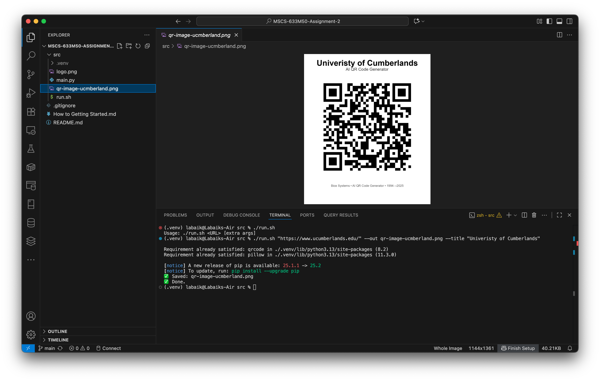
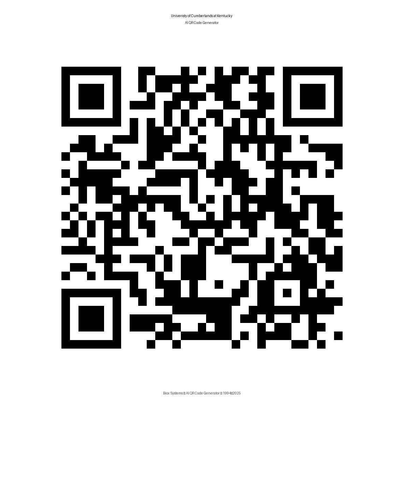

### Date: 09/21/2025

Term: 2025 Fall

Course: Advance Artificial Intelligence (MSCS-633-M50)

Name: Samrat Baral

Assisgment 2: Biox Systems — AI QR Code Generator (Python)

A tiny, reliable CLI app that turns any URL into a **brandable, layout-ready QR poster** (title, subtitle, QR with optional center logo, footer). Uses high error-correction, so a small logo won’t break scans.

> **History:** The QR Code (Quick Response code) was invented in **1994** by **Denso Wave** (Japan), as a fast, two-dimensional, machine-readable way to encode information.

---

## 📦 Repository & Source

- **Repo:** [https://github.com/baralsamrat/MSCS-633M50-Assignment-2](https://github.com/baralsamrat/MSCS-633M50-Assignment-2)

- **Main script:** [`main.py`](https://github.com/baralsamrat/MSCS-633M50-Assignment-2/blob/main/src/main.py)
- **Mac one-shot runner (optional):** [`run.sh`](https://github.com/baralsamrat/MSCS-633M50-Assignment-2/blob/main/src/run.sh)

---

## Requirments

- python3 -m venv .venv
- source .venv/bin/activate
- pip install qrcode pillow
- Run src/run.sh on MacOS or Linux System
- deactivate venv

---

## 🧪 Example

```bash
python main.py "https://www.ucumberlands.edu/" \
  --out main_sample.png \
  --title "Univeristy of Cumberlands" \
  --subtitle "QR Code" \
  --footer "Biox Systems • AI QR Code Generator • 1994→Sep 21 2025" \
  --size 900 --border 4 --pad 80
```

OR

```cmd
chmod +x run.sh

./run.sh "https://www.ucumberlands.edu/" --out qr-image-ucmberland.png --title "Univeristy of Cumberlands"
```


OUTPUT:

```cmd
Saved: qr-image-ucmberland.png
✅ Done.
```



## ✨ Features

- **Crisp QR** (no blurry resize): computes exact pixel size for the QR grid
- **High error correction (H)**: safe for a small **center logo** overlay
- **Clean layout**: Title, Subtitle, QR, Footer — all **optional**
- **Accessible colors**: accepts hex or named colors, validated safely
- **Single file**: easy to drop into any project, works on macOS/Windows/Linux

---
# [HOW TO GETTING STARTED](./How%20to%20Getting%20Started.md)